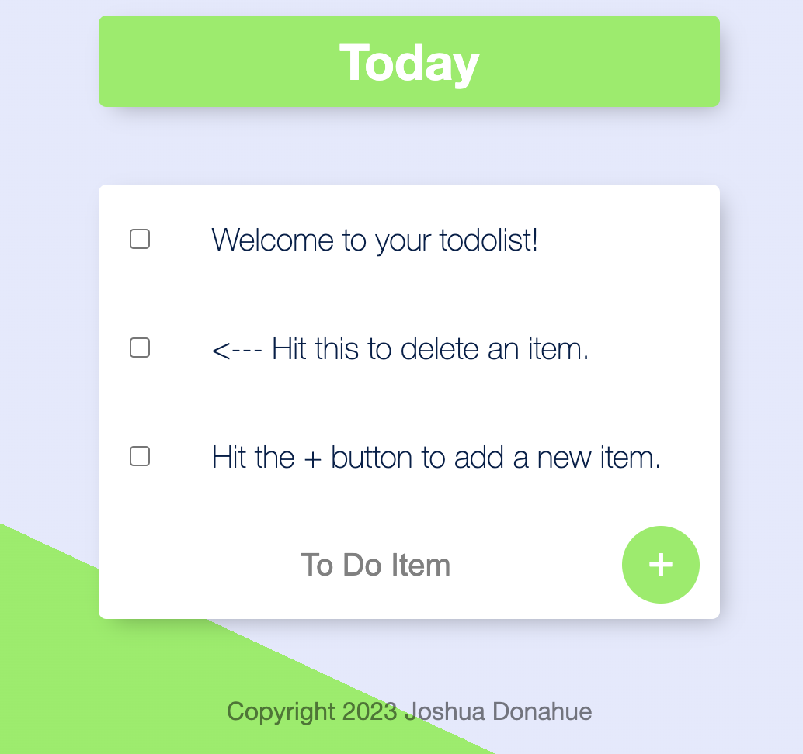
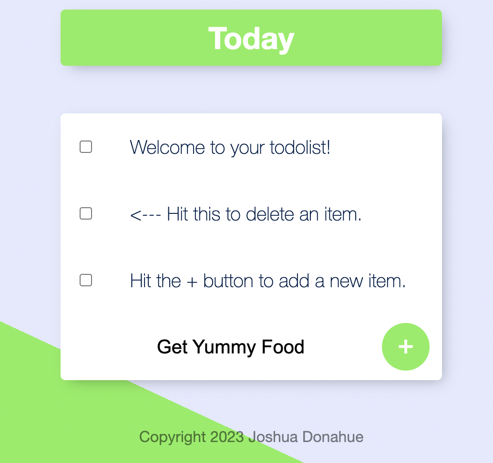
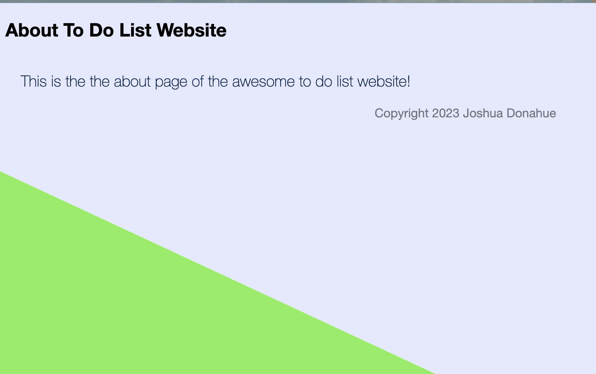

# To-Do List v2

This project is a To-Do List app using Node.js, Express.js,EJS, MongoDB, and Mongoose. The primary focus is EJS templates/layout customization with MongoDB & Mongoose functionality. There is a normal To-Do List & also a work To-Do List. You can also create a dynamic To-Do List as well.

---

## Normal To-Do List

There is a normal To-Do List found on the "/" home path where you can add items to the list.

---

## Work To-Do List

 There is a normal To-Do List found on the "/work" path where you can add items to the list. To add an additional list simply add "/work" to the url. This will create an additional To-Do List for "Work".

---

## Custom To-Do List

There is a normal To-Do List found on the "/work" path where you can add items to the list. To add an additional custom list simply add "/insertCustomListNameHere" to the url. This will create an additional custom To-Do List based on the name provided.

---

## About Page

There is also an about page for the app which can be found at "/about" path.

---

## Dynamic To-Do List

Dynamic To-Do List's can also be created after the "/" in the url by simply adding a new name. Example: "/NewToDoListName". If the To-Do List already exists then it will simply redirect to the To-Do List.

---

### .env 

You will notice the .env_sample file. This is an example file used to store your personal MongoDB Atlas user and cluster info. You will need to create your own .env file with this info provided.